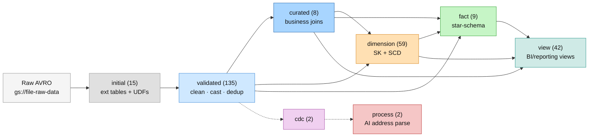
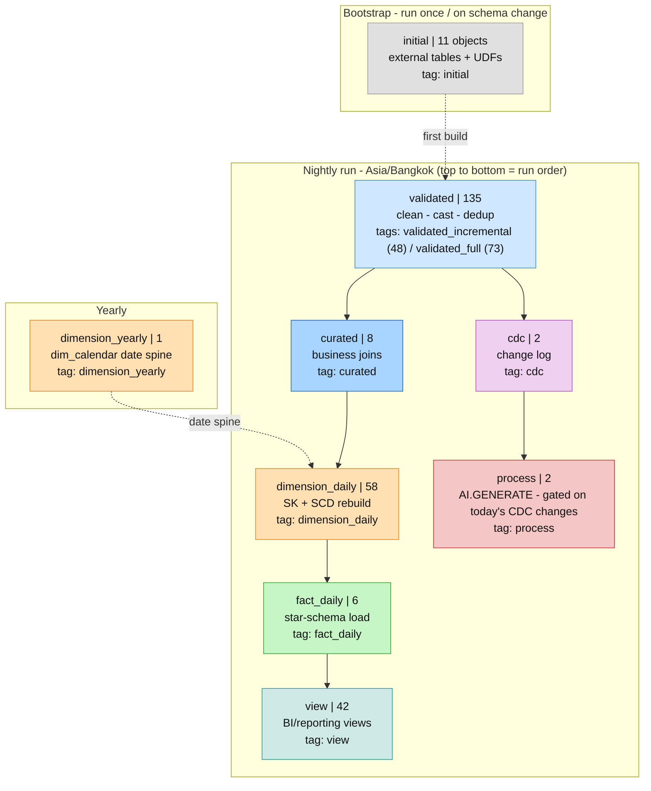

# Pipeline Lineage

> ⚠️ **Auto-generated — do not edit by hand.** Regenerate after any change to
> `definitions/` with `python document/diagrams/generate_lineage.py` (`python3` on
> Linux/Mac). The local pre-commit hook does this automatically when a commit stages
> `definitions/*.sqlx`. The script parses every `.sqlx` (`dependencies: [...]` +
> inline `ref(...)` + `tags: [...]`), so the views — and `topic_flows.md` — always
> match the repo.

**Objects: 272** — initial 15 · validated 135 · curated 8 · dimension 59 · fact 9 · view 42 · cdc 2 · process 2

**Paused (config commented out):** fact_chq, fact_mir_rs, fact_mir_vs

Edges point **source → consumer**. Operational scaffolding (the `initial` layer
and `*_schema_*` objects) is omitted from the detail views below — it only wires
the bootstrap and would add hundreds of noise edges. Paused objects are dashed.

---

## 1. Layer overview

The medallion → star-schema map. Counts are live.



---

## 2. Execution / run order

The tag-driven orchestration: what runs, in what order, on what cadence. Counts are
the number of (non-paused) objects carrying each tag. Solid arrows = run order;
dashed = a prerequisite from another cadence.



---

## 3. Star schema — what feeds each fact

Every `fact_*` table and the dimensions / curated tables it joins.

```mermaid
flowchart LR
  subgraph validated["validated (5)"]
    deb["deb"]
    tbook_quodetail["tbook_quodetail"]
    tdelivery["tdelivery"]
    ttrip["ttrip"]
    ttrip_document["ttrip_document"]
  end
  subgraph curated["curated (2)"]
    curated_mih["curated_mih"]
    curated_mil["curated_mil"]
  end
  subgraph dimension["dimension (22)"]
    dim_change_district["dim_change_district"]
    dim_channel["dim_channel"]
    dim_channel_cost["dim_channel_cost"]
    dim_cost_group["dim_cost_group"]
    dim_cost_stk["dim_cost_stk"]
    dim_customer["dim_customer"]
    dim_delivery["dim_delivery"]
    dim_department["dim_department"]
    dim_director["dim_director"]
    dim_invoice["dim_invoice"]
    dim_order["dim_order"]
    dim_payment["dim_payment"]
    dim_product_master["dim_product_master"]
    dim_product_mkt["dim_product_mkt"]
    dim_quotation["dim_quotation"]
    dim_region["dim_region"]
    dim_region_manager["dim_region_manager"]
    dim_sale_representative["dim_sale_representative"]
    dim_section["dim_section"]
    dim_section_manager["dim_section_manager"]
    dim_stk_mkt["dim_stk_mkt"]
    dim_target_product_group_by_sale_dayofwork["dim_target_product_group_by_sale_dayofwork"]
  end
  subgraph fact["fact (9)"]
    fact_chq["fact_chq (paused)"]
    fact_delivery["fact_delivery"]
    fact_invoice["fact_invoice"]
    fact_mir_rs["fact_mir_rs (paused)"]
    fact_mir_vs["fact_mir_vs (paused)"]
    fact_order["fact_order"]
    fact_quotation["fact_quotation"]
    fact_transaction_delivery["fact_transaction_delivery"]
    fact_transcation["fact_transcation"]
  end
  curated_mih --> fact_delivery
  curated_mih --> fact_transcation
  curated_mil --> fact_delivery
  curated_mil --> fact_invoice
  curated_mil --> fact_order
  curated_mil --> fact_transaction_delivery
  curated_mil --> fact_transcation
  deb --> fact_delivery
  deb --> fact_transcation
  dim_change_district --> fact_transcation
  dim_channel --> fact_transcation
  dim_channel_cost --> fact_transcation
  dim_cost_group --> fact_transcation
  dim_cost_stk --> fact_transcation
  dim_customer --> fact_invoice
  dim_customer --> fact_order
  dim_customer --> fact_quotation
  dim_customer --> fact_transcation
  dim_delivery --> fact_delivery
  dim_department --> fact_transcation
  dim_director --> fact_transcation
  dim_invoice --> fact_invoice
  dim_invoice --> fact_transaction_delivery
  dim_order --> fact_order
  dim_payment --> fact_transcation
  dim_product_master --> fact_order
  dim_product_master --> fact_quotation
  dim_product_master --> fact_transaction_delivery
  dim_product_master --> fact_transcation
  dim_product_mkt --> fact_transcation
  dim_quotation --> fact_quotation
  dim_region --> fact_transcation
  dim_region_manager --> fact_transcation
  dim_sale_representative --> fact_transcation
  dim_section --> fact_transcation
  dim_section_manager --> fact_transcation
  dim_stk_mkt --> fact_transcation
  dim_target_product_group_by_sale_dayofwork --> fact_transcation
  fact_order --> fact_invoice
  fact_quotation --> fact_order
  fact_transaction_delivery --> fact_delivery
  tbook_quodetail --> fact_quotation
  tdelivery --> fact_delivery
  ttrip --> fact_delivery
  ttrip_document --> fact_delivery
  classDef validated fill:#cfe8ff,stroke:#4a90d9,color:#111;
  classDef curated fill:#a8d5ff,stroke:#2f6fb0,color:#111;
  classDef dimension fill:#ffe0b3,stroke:#d98f2f,color:#111;
  classDef fact fill:#c6f5c6,stroke:#3fa63f,color:#111;
  classDef paused fill:#f5f5f5,stroke:#bbb,color:#999,stroke-dasharray:4 3;
  class deb,tbook_quodetail,tdelivery,ttrip,ttrip_document validated;
  class curated_mih,curated_mil curated;
  class dim_change_district,dim_channel,dim_channel_cost,dim_cost_group,dim_cost_stk,dim_customer,dim_delivery,dim_department,dim_director,dim_invoice,dim_order,dim_payment,dim_product_master,dim_product_mkt,dim_quotation,dim_region,dim_region_manager,dim_sale_representative,dim_section,dim_section_manager,dim_stk_mkt,dim_target_product_group_by_sale_dayofwork dimension;
  class fact_delivery,fact_invoice,fact_order,fact_quotation,fact_transaction_delivery,fact_transcation fact;
  class fact_chq,fact_mir_rs,fact_mir_vs paused;
```



---

## 4. Dimension backbone — build order

`dim_company` is the DAG root; the `_last` snapshots feed `update_sk_sale_rep_group`
and the target-by-sale chain. Only `dimension → dimension` edges are shown.

```mermaid
flowchart LR
  subgraph dimension["dimension (58)"]
    dim_aging["dim_aging"]
    dim_aging_rang["dim_aging_rang"]
    dim_avg_collection_score["dim_avg_collection_score"]
    dim_bounce_cheque_score["dim_bounce_cheque_score"]
    dim_calendar["dim_calendar"]
    dim_change_district["dim_change_district"]
    dim_channel["dim_channel"]
    dim_channel_cost["dim_channel_cost"]
    dim_channel_finance["dim_channel_finance"]
    dim_channel_sales["dim_channel_sales"]
    dim_collection_status["dim_collection_status"]
    dim_company["dim_company"]
    dim_contact_score["dim_contact_score"]
    dim_cost_group["dim_cost_group"]
    dim_cost_stk["dim_cost_stk"]
    dim_customer["dim_customer"]
    dim_customer_grade["dim_customer_grade"]
    dim_delivery["dim_delivery"]
    dim_department["dim_department"]
    dim_department_last["dim_department_last"]
    dim_director["dim_director"]
    dim_director_last["dim_director_last"]
    dim_doctype["dim_doctype"]
    dim_grade["dim_grade"]
    dim_group_customer["dim_group_customer"]
    dim_group_customer_grade["dim_group_customer_grade"]
    dim_guarantee["dim_guarantee"]
    dim_invoice["dim_invoice"]
    dim_order["dim_order"]
    dim_payment["dim_payment"]
    dim_payment_receive_score["dim_payment_receive_score"]
    dim_product_master["dim_product_master"]
    dim_product_master_fc["dim_product_master_fc"]
    dim_product_mkt["dim_product_mkt"]
    dim_product_mkt_director["dim_product_mkt_director"]
    dim_project["dim_project"]
    dim_quotation["dim_quotation"]
    dim_rate_target["dim_rate_target"]
    dim_rebate["dim_rebate"]
    dim_region["dim_region"]
    dim_region_last["dim_region_last"]
    dim_region_manager["dim_region_manager"]
    dim_region_manager_last["dim_region_manager_last"]
    dim_report["dim_report"]
    dim_sale_representative["dim_sale_representative"]
    dim_sale_representative_last["dim_sale_representative_last"]
    dim_section["dim_section"]
    dim_section_last["dim_section_last"]
    dim_section_manager["dim_section_manager"]
    dim_section_manager_last["dim_section_manager_last"]
    dim_status_not_receive["dim_status_not_receive"]
    dim_stk_mkt["dim_stk_mkt"]
    dim_target_product_group["dim_target_product_group"]
    dim_target_product_group_by_sale["dim_target_product_group_by_sale"]
    dim_target_product_group_by_sale_dayofwork["dim_target_product_group_by_sale_dayofwork"]
    dim_waterpac["dim_waterpac"]
    dim_weight_score["dim_weight_score"]
    update_sk_sale_rep_group["update_sk_sale_rep_group"]
  end
  dim_aging --> dim_customer_grade
  dim_aging --> dim_group_customer_grade
  dim_avg_collection_score --> dim_customer_grade
  dim_avg_collection_score --> dim_group_customer_grade
  dim_bounce_cheque_score --> dim_customer_grade
  dim_bounce_cheque_score --> dim_group_customer_grade
  dim_calendar --> dim_target_product_group_by_sale_dayofwork
  dim_company --> dim_aging
  dim_company --> dim_aging_rang
  dim_company --> dim_avg_collection_score
  dim_company --> dim_bounce_cheque_score
  dim_company --> dim_change_district
  dim_company --> dim_channel
  dim_company --> dim_channel_cost
  dim_company --> dim_channel_finance
  dim_company --> dim_channel_sales
  dim_company --> dim_collection_status
  dim_company --> dim_contact_score
  dim_company --> dim_cost_group
  dim_company --> dim_cost_stk
  dim_company --> dim_customer
  dim_company --> dim_delivery
  dim_company --> dim_department
  dim_company --> dim_department_last
  dim_company --> dim_director
  dim_company --> dim_director_last
  dim_company --> dim_doctype
  dim_company --> dim_grade
  dim_company --> dim_guarantee
  dim_company --> dim_invoice
  dim_company --> dim_order
  dim_company --> dim_payment
  dim_company --> dim_payment_receive_score
  dim_company --> dim_product_master
  dim_company --> dim_product_master_fc
  dim_company --> dim_product_mkt
  dim_company --> dim_product_mkt_director
  dim_company --> dim_project
  dim_company --> dim_quotation
  dim_company --> dim_rate_target
  dim_company --> dim_rebate
  dim_company --> dim_region
  dim_company --> dim_region_last
  dim_company --> dim_region_manager
  dim_company --> dim_region_manager_last
  dim_company --> dim_report
  dim_company --> dim_sale_representative
  dim_company --> dim_sale_representative_last
  dim_company --> dim_section
  dim_company --> dim_section_last
  dim_company --> dim_section_manager
  dim_company --> dim_section_manager_last
  dim_company --> dim_status_not_receive
  dim_company --> dim_stk_mkt
  dim_company --> dim_target_product_group
  dim_company --> dim_waterpac
  dim_company --> dim_weight_score
  dim_contact_score --> dim_customer_grade
  dim_contact_score --> dim_group_customer_grade
  dim_customer --> dim_aging
  dim_customer --> dim_customer_grade
  dim_customer --> dim_group_customer
  dim_customer --> dim_group_customer_grade
  dim_department --> dim_department_last
  dim_department_last --> dim_rate_target
  dim_department_last --> update_sk_sale_rep_group
  dim_director --> dim_director_last
  dim_director_last --> dim_rate_target
  dim_director_last --> update_sk_sale_rep_group
  dim_grade --> dim_customer_grade
  dim_grade --> dim_group_customer_grade
  dim_group_customer --> dim_group_customer_grade
  dim_invoice --> dim_aging
  dim_order --> dim_invoice
  dim_payment_receive_score --> dim_customer_grade
  dim_payment_receive_score --> dim_group_customer_grade
  dim_product_mkt --> dim_product_master
  dim_product_mkt --> dim_target_product_group_by_sale
  dim_project --> dim_quotation
  dim_rate_target --> dim_target_product_group_by_sale
  dim_rate_target --> dim_target_product_group_by_sale_dayofwork
  dim_rebate --> dim_product_master
  dim_region --> dim_region_last
  dim_region_last --> update_sk_sale_rep_group
  dim_region_manager --> dim_region_manager_last
  dim_region_manager_last --> update_sk_sale_rep_group
  dim_report --> dim_target_product_group_by_sale
  dim_sale_representative --> dim_sale_representative_last
  dim_sale_representative_last --> update_sk_sale_rep_group
  dim_section --> dim_section_last
  dim_section_last --> update_sk_sale_rep_group
  dim_section_manager --> dim_section_manager_last
  dim_section_manager_last --> update_sk_sale_rep_group
  dim_status_not_receive --> dim_aging
  dim_status_not_receive --> dim_customer_grade
  dim_status_not_receive --> dim_group_customer_grade
  dim_stk_mkt --> dim_product_master
  dim_target_product_group --> dim_target_product_group_by_sale
  dim_target_product_group_by_sale --> dim_target_product_group_by_sale_dayofwork
  update_sk_sale_rep_group --> dim_rate_target
  update_sk_sale_rep_group --> dim_target_product_group_by_sale
  classDef dimension fill:#ffe0b3,stroke:#d98f2f,color:#111;
  classDef paused fill:#f5f5f5,stroke:#bbb,color:#999,stroke-dasharray:4 3;
  class dim_aging,dim_aging_rang,dim_avg_collection_score,dim_bounce_cheque_score,dim_calendar,dim_change_district,dim_channel,dim_channel_cost,dim_channel_finance,dim_channel_sales,dim_collection_status,dim_company,dim_contact_score,dim_cost_group,dim_cost_stk,dim_customer,dim_customer_grade,dim_delivery,dim_department,dim_department_last,dim_director,dim_director_last,dim_doctype,dim_grade,dim_group_customer,dim_group_customer_grade,dim_guarantee,dim_invoice,dim_order,dim_payment,dim_payment_receive_score,dim_product_master,dim_product_master_fc,dim_product_mkt,dim_product_mkt_director,dim_project,dim_quotation,dim_rate_target,dim_rebate,dim_region,dim_region_last,dim_region_manager,dim_region_manager_last,dim_report,dim_sale_representative,dim_sale_representative_last,dim_section,dim_section_last,dim_section_manager,dim_section_manager_last,dim_status_not_receive,dim_stk_mkt,dim_target_product_group,dim_target_product_group_by_sale,dim_target_product_group_by_sale_dayofwork,dim_waterpac,dim_weight_score,update_sk_sale_rep_group dimension;
```



---

## 5. Source → model

How `validated` / `curated` tables flow into dimensions and facts (scaffolding
excluded). This is the densest view — open it on GitHub or mermaid.live to zoom.

```mermaid
flowchart LR
  subgraph validated["validated (34)"]
    ap_s["ap_s"]
    ar_s["ar_s"]
    brand["brand"]
    category__mastersku["category"]
    cfs["cfs"]
    chq["chq"]
    cql["cql"]
    customer_profile["customer_profile"]
    customer_profile_nature_business["customer_profile_nature_business"]
    customer_status["customer_status"]
    customer_type["customer_type"]
    deb["deb"]
    match_customer["match_customer"]
    mie["mie"]
    mih["mih"]
    mih2["mih2"]
    mil["mil"]
    mir["mir"]
    nature_business["nature_business"]
    per["per"]
    product["product"]
    product_detail["product_detail"]
    stg["stg"]
    stg_report["stg_report"]
    stgacc["stgacc"]
    stk["stk"]
    tbook_profilecomp["tbook_profilecomp"]
    tbook_quodetail["tbook_quodetail"]
    tbook_quotation["tbook_quotation"]
    tdelivery["tdelivery"]
    ttrip["ttrip"]
    ttrip_document["ttrip_document"]
    unit["unit"]
    vendor["vendor"]
  end
  subgraph curated["curated (5)"]
    curated_mih["curated_mih"]
    curated_mil["curated_mil"]
    curated_product["curated_product"]
    curated_tbook_quotation["curated_tbook_quotation"]
    product_for_aisearch["product_for_aisearch"]
  end
  subgraph dimension["dimension (13)"]
    dim_aging["dim_aging"]
    dim_customer["dim_customer"]
    dim_customer_grade["dim_customer_grade"]
    dim_delivery["dim_delivery"]
    dim_group_customer_grade["dim_group_customer_grade"]
    dim_invoice["dim_invoice"]
    dim_order["dim_order"]
    dim_product_master["dim_product_master"]
    dim_project["dim_project"]
    dim_quotation["dim_quotation"]
    dim_sale_representative["dim_sale_representative"]
    dim_sale_representative_last["dim_sale_representative_last"]
    dim_stk_mkt["dim_stk_mkt"]
  end
  subgraph fact["fact (6)"]
    fact_delivery["fact_delivery"]
    fact_invoice["fact_invoice"]
    fact_order["fact_order"]
    fact_quotation["fact_quotation"]
    fact_transaction_delivery["fact_transaction_delivery"]
    fact_transcation["fact_transcation"]
  end
  ap_s --> curated_mih
  ap_s --> dim_invoice
  ar_s --> curated_mih
  ar_s --> dim_aging
  ar_s --> dim_invoice
  ar_s --> dim_order
  brand --> product_for_aisearch
  category__mastersku --> product_for_aisearch
  cfs --> dim_aging
  chq --> dim_aging
  chq --> dim_customer_grade
  chq --> dim_group_customer_grade
  cql --> dim_aging
  cql --> dim_customer_grade
  cql --> dim_group_customer_grade
  curated_mih --> dim_aging
  curated_mih --> dim_customer_grade
  curated_mih --> dim_delivery
  curated_mih --> dim_group_customer_grade
  curated_mih --> dim_invoice
  curated_mih --> dim_order
  curated_mih --> dim_quotation
  curated_mih --> fact_delivery
  curated_mih --> fact_transcation
  curated_mil --> dim_aging
  curated_mil --> dim_delivery
  curated_mil --> dim_invoice
  curated_mil --> dim_order
  curated_mil --> dim_quotation
  curated_mil --> fact_delivery
  curated_mil --> fact_invoice
  curated_mil --> fact_order
  curated_mil --> fact_transaction_delivery
  curated_mil --> fact_transcation
  curated_product --> product_for_aisearch
  curated_tbook_quotation --> dim_quotation
  customer_profile --> dim_customer
  customer_profile_nature_business --> dim_customer
  customer_status --> dim_customer
  customer_type --> dim_customer
  deb --> dim_customer
  deb --> dim_customer_grade
  deb --> dim_delivery
  deb --> dim_group_customer_grade
  deb --> fact_delivery
  deb --> fact_transcation
  match_customer --> dim_customer
  mie --> dim_aging
  mie --> dim_customer_grade
  mie --> dim_group_customer_grade
  mih --> curated_mih
  mih --> dim_customer_grade
  mih --> dim_group_customer_grade
  mih --> mil
  mih2 --> curated_mih
  mih2 --> curated_mil
  mih2 --> dim_invoice
  mil --> curated_mil
  mir --> dim_aging
  mir --> dim_customer_grade
  mir --> dim_group_customer_grade
  nature_business --> dim_customer
  per --> dim_sale_representative
  per --> dim_sale_representative_last
  product --> curated_product
  product --> dim_product_master
  product_detail --> curated_product
  product_detail --> dim_product_master
  product_detail --> product_for_aisearch
  stg --> dim_product_master
  stg_report --> stg
  stgacc --> stg
  stk --> dim_product_master
  stk --> dim_stk_mkt
  tbook_profilecomp --> dim_project
  tbook_quodetail --> dim_quotation
  tbook_quodetail --> fact_quotation
  tbook_quotation --> curated_tbook_quotation
  tdelivery --> dim_delivery
  tdelivery --> fact_delivery
  ttrip --> dim_delivery
  ttrip --> fact_delivery
  ttrip_document --> dim_delivery
  ttrip_document --> fact_delivery
  unit --> product_for_aisearch
  vendor --> product_for_aisearch
  classDef validated fill:#cfe8ff,stroke:#4a90d9,color:#111;
  classDef curated fill:#a8d5ff,stroke:#2f6fb0,color:#111;
  classDef dimension fill:#ffe0b3,stroke:#d98f2f,color:#111;
  classDef fact fill:#c6f5c6,stroke:#3fa63f,color:#111;
  classDef paused fill:#f5f5f5,stroke:#bbb,color:#999,stroke-dasharray:4 3;
  class ap_s,ar_s,brand,category__mastersku,cfs,chq,cql,customer_profile,customer_profile_nature_business,customer_status,customer_type,deb,match_customer,mie,mih,mih2,mil,mir,nature_business,per,product,product_detail,stg,stg_report,stgacc,stk,tbook_profilecomp,tbook_quodetail,tbook_quotation,tdelivery,ttrip,ttrip_document,unit,vendor validated;
  class curated_mih,curated_mil,curated_product,curated_tbook_quotation,product_for_aisearch curated;
  class dim_aging,dim_customer,dim_customer_grade,dim_delivery,dim_group_customer_grade,dim_invoice,dim_order,dim_product_master,dim_project,dim_quotation,dim_sale_representative,dim_sale_representative_last,dim_stk_mkt dimension;
  class fact_delivery,fact_invoice,fact_order,fact_quotation,fact_transaction_delivery,fact_transcation fact;
```



---

## 6. View layer — what each view reads

Every `view_*` (BI/reporting layer) and the dimensions / facts / curated tables /
other views it selects from. Edges captured from each view's `dependencies[]`.

```mermaid
flowchart LR
  subgraph validated["validated (27)"]
    ap_s["ap_s"]
    ar_s["ar_s"]
    brand["brand"]
    category__mastersku["category"]
    chq["chq"]
    cql["cql"]
    customer_profile["customer_profile"]
    customer_profile_nature_business["customer_profile_nature_business"]
    customer_status["customer_status"]
    customer_type["customer_type"]
    deb["deb"]
    match_customer["match_customer"]
    mih["mih"]
    mih2["mih2"]
    mir["mir"]
    nature_business["nature_business"]
    per["per"]
    product["product"]
    product_detail["product_detail"]
    stg["stg"]
    stk["stk"]
    stk_mkt["stk_mkt"]
    tbook_profilecomp["tbook_profilecomp"]
    tdelivery["tdelivery"]
    ttrip["ttrip"]
    ttrip_document["ttrip_document"]
    vendor["vendor"]
  end
  subgraph curated["curated (3)"]
    curated_mih["curated_mih"]
    curated_mil["curated_mil"]
    curated_tbook_quotation["curated_tbook_quotation"]
  end
  subgraph dimension["dimension (45)"]
    dim_aging["dim_aging"]
    dim_aging_rang["dim_aging_rang"]
    dim_calendar["dim_calendar"]
    dim_change_district["dim_change_district"]
    dim_channel["dim_channel"]
    dim_channel_cost["dim_channel_cost"]
    dim_channel_finance["dim_channel_finance"]
    dim_channel_sales["dim_channel_sales"]
    dim_company["dim_company"]
    dim_cost_group["dim_cost_group"]
    dim_cost_stk["dim_cost_stk"]
    dim_customer["dim_customer"]
    dim_customer_grade["dim_customer_grade"]
    dim_department["dim_department"]
    dim_department_last["dim_department_last"]
    dim_director["dim_director"]
    dim_director_last["dim_director_last"]
    dim_doctype["dim_doctype"]
    dim_group_customer["dim_group_customer"]
    dim_guarantee["dim_guarantee"]
    dim_invoice["dim_invoice"]
    dim_order["dim_order"]
    dim_payment["dim_payment"]
    dim_product_master["dim_product_master"]
    dim_product_mkt["dim_product_mkt"]
    dim_product_mkt_director["dim_product_mkt_director"]
    dim_rate_target["dim_rate_target"]
    dim_rebate["dim_rebate"]
    dim_region["dim_region"]
    dim_region_last["dim_region_last"]
    dim_region_manager["dim_region_manager"]
    dim_region_manager_last["dim_region_manager_last"]
    dim_report["dim_report"]
    dim_sale_representative["dim_sale_representative"]
    dim_sale_representative_last["dim_sale_representative_last"]
    dim_section["dim_section"]
    dim_section_last["dim_section_last"]
    dim_section_manager["dim_section_manager"]
    dim_section_manager_last["dim_section_manager_last"]
    dim_status_not_receive["dim_status_not_receive"]
    dim_stk_mkt["dim_stk_mkt"]
    dim_target_product_group["dim_target_product_group"]
    dim_target_product_group_by_sale["dim_target_product_group_by_sale"]
    dim_target_product_group_by_sale_dayofwork["dim_target_product_group_by_sale_dayofwork"]
    dim_waterpac["dim_waterpac"]
  end
  subgraph fact["fact (5)"]
    fact_invoice["fact_invoice"]
    fact_mir_rs["fact_mir_rs (paused)"]
    fact_mir_vs["fact_mir_vs (paused)"]
    fact_order["fact_order"]
    fact_transcation["fact_transcation"]
  end
  subgraph view["view (42)"]
    Dimension_Cheque["Dimension_Cheque"]
    Dimension_Customer["Dimension_Customer"]
    Dimension_Delivery["Dimension_Delivery"]
    Dimension_Invoice["Dimension_Invoice"]
    Dimension_Order["Dimension_Order"]
    Dimension_Project["Dimension_Project"]
    Dimension_Quotation["Dimension_Quotation"]
    GroupCustomerSK_CustomerSK["GroupCustomerSK_CustomerSK"]
    Model_Invoice_Transaction["Model_Invoice_Transaction"]
    Model_Target_DayOfWork["Model_Target_DayOfWork"]
    PowerBI_Data_Buffet_Transaction["PowerBI_Data_Buffet_Transaction"]
    Product_Attribute["Product_Attribute"]
    Product_Master["Product_Master"]
    Product_Master_ALL["Product_Master_ALL"]
    Sales_Per_Non_Master["Sales_Per_Non_Master"]
    Transaction_Data_Mart["Transaction_Data_Mart"]
    View_Product["View_Product"]
    view_aging_ri["view_aging_ri"]
    view_deb_address_data["view_deb_address_data"]
    view_dim_aging["view_dim_aging"]
    view_dim_aging_history["view_dim_aging_history"]
    view_dim_channel["view_dim_channel"]
    view_dim_company["view_dim_company"]
    view_dim_customer["view_dim_customer"]
    view_dim_customer_credit_management["view_dim_customer_credit_management"]
    view_dim_guarantee["view_dim_guarantee"]
    view_dim_invoice["view_dim_invoice"]
    view_dim_order["view_dim_order"]
    view_dim_product_master["view_dim_product_master"]
    view_dim_product_mkt["view_dim_product_mkt"]
    view_dim_sale_representative["view_dim_sale_representative"]
    view_dim_sale_representative_last["view_dim_sale_representative_last"]
    view_dim_target_by_agent["view_dim_target_by_agent"]
    view_dim_target_by_agent_dayofwork["view_dim_target_by_agent_dayofwork"]
    view_fact_mir_rs["view_fact_mir_rs"]
    view_fact_mir_vs["view_fact_mir_vs"]
    view_fact_transcation["view_fact_transcation"]
    view_mih_address_data["view_mih_address_data"]
    view_rls_data["view_rls_data"]
    view_rls_sale_data["view_rls_sale_data"]
    view_rls_special_data["view_rls_special_data"]
    view_sales_representative_last["view_sales_representative_last"]
  end
  subgraph process["process (1)"]
    deb_address_data["deb_address_data"]
  end
  Product_Attribute --> Product_Master_ALL
  ap_s --> Dimension_Invoice
  ar_s --> Dimension_Invoice
  ar_s --> Dimension_Order
  ar_s --> view_aging_ri
  ar_s --> view_fact_mir_rs
  brand --> Product_Attribute
  brand --> Product_Master
  brand --> View_Product
  category__mastersku --> View_Product
  chq --> Dimension_Cheque
  chq --> view_aging_ri
  cql --> Dimension_Cheque
  cql --> view_aging_ri
  curated_mih --> Dimension_Delivery
  curated_mih --> Dimension_Order
  curated_mih --> PowerBI_Data_Buffet_Transaction
  curated_mih --> Transaction_Data_Mart
  curated_mih --> view_aging_ri
  curated_mih --> view_fact_mir_rs
  curated_mih --> view_fact_transcation
  curated_mil --> Dimension_Delivery
  curated_mil --> PowerBI_Data_Buffet_Transaction
  curated_mil --> Transaction_Data_Mart
  curated_tbook_quotation --> Dimension_Quotation
  curated_tbook_quotation --> Transaction_Data_Mart
  customer_profile --> Dimension_Customer
  customer_profile_nature_business --> Dimension_Customer
  customer_status --> Dimension_Customer
  customer_type --> Dimension_Customer
  deb --> Dimension_Customer
  deb --> Dimension_Delivery
  deb --> view_fact_transcation
  deb_address_data --> view_deb_address_data
  dim_aging --> view_dim_aging
  dim_aging --> view_dim_invoice
  dim_aging --> view_fact_mir_rs
  dim_aging --> view_fact_mir_vs
  dim_aging_rang --> view_aging_ri
  dim_aging_rang --> view_dim_aging
  dim_calendar --> view_dim_target_by_agent_dayofwork
  dim_calendar --> view_fact_transcation
  dim_change_district --> view_fact_transcation
  dim_channel --> Model_Invoice_Transaction
  dim_channel --> view_dim_channel
  dim_channel --> view_fact_transcation
  dim_channel_cost --> Model_Invoice_Transaction
  dim_channel_cost --> view_dim_channel
  dim_channel_finance --> view_dim_channel
  dim_channel_sales --> view_dim_channel
  dim_company --> Product_Attribute
  dim_company --> Transaction_Data_Mart
  dim_company --> view_dim_company
  dim_company --> view_fact_transcation
  dim_cost_group --> view_fact_transcation
  dim_cost_stk --> view_fact_transcation
  dim_customer --> GroupCustomerSK_CustomerSK
  dim_customer --> view_dim_customer
  dim_customer --> view_dim_customer_credit_management
  dim_customer --> view_dim_guarantee
  dim_customer_grade --> view_dim_customer_credit_management
  dim_department --> view_dim_sale_representative
  dim_department --> view_dim_target_by_agent_dayofwork
  dim_department_last --> Model_Invoice_Transaction
  dim_department_last --> Model_Target_DayOfWork
  dim_department_last --> view_dim_sale_representative_last
  dim_department_last --> view_dim_target_by_agent
  dim_department_last --> view_fact_transcation
  dim_department_last --> view_sales_representative_last
  dim_director --> view_dim_target_by_agent_dayofwork
  dim_director --> view_fact_transcation
  dim_director_last --> Model_Invoice_Transaction
  dim_director_last --> Model_Target_DayOfWork
  dim_director_last --> view_fact_transcation
  dim_director_last --> view_rls_data
  dim_doctype --> Model_Invoice_Transaction
  dim_group_customer --> GroupCustomerSK_CustomerSK
  dim_group_customer --> view_dim_customer
  dim_guarantee --> view_dim_guarantee
  dim_guarantee --> view_fact_transcation
  dim_invoice --> Model_Invoice_Transaction
  dim_invoice --> view_aging_ri
  dim_invoice --> view_dim_invoice
  dim_order --> view_dim_order
  dim_payment --> Model_Invoice_Transaction
  dim_product_master --> Model_Invoice_Transaction
  dim_product_master --> Product_Attribute
  dim_product_master --> Product_Master_ALL
  dim_product_master --> view_dim_product_master
  dim_product_master --> view_fact_transcation
  dim_product_mkt --> Model_Invoice_Transaction
  dim_product_mkt --> Model_Target_DayOfWork
  dim_product_mkt --> view_dim_product_master
  dim_product_mkt --> view_dim_product_mkt
  dim_product_mkt --> view_dim_target_by_agent
  dim_product_mkt --> view_fact_transcation
  dim_product_mkt_director --> Product_Master_ALL
  dim_product_mkt_director --> view_dim_product_mkt
  dim_rate_target --> view_dim_target_by_agent
  dim_rebate --> view_dim_product_master
  dim_rebate --> view_fact_transcation
  dim_region --> view_dim_target_by_agent_dayofwork
  dim_region --> view_fact_transcation
  dim_region_last --> Model_Invoice_Transaction
  dim_region_last --> Model_Target_DayOfWork
  dim_region_last --> view_dim_target_by_agent
  dim_region_last --> view_fact_transcation
  dim_region_last --> view_rls_data
  dim_region_last --> view_sales_representative_last
  dim_region_manager --> view_dim_target_by_agent_dayofwork
  dim_region_manager --> view_fact_transcation
  dim_region_manager_last --> Model_Invoice_Transaction
  dim_region_manager_last --> Model_Target_DayOfWork
  dim_region_manager_last --> view_dim_target_by_agent
  dim_region_manager_last --> view_rls_data
  dim_report --> Model_Invoice_Transaction
  dim_report --> Model_Target_DayOfWork
  dim_report --> view_dim_target_by_agent
  dim_report --> view_fact_transcation
  dim_sale_representative --> Sales_Per_Non_Master
  dim_sale_representative --> view_dim_sale_representative
  dim_sale_representative --> view_dim_target_by_agent_dayofwork
  dim_sale_representative --> view_fact_transcation
  dim_sale_representative_last --> Model_Invoice_Transaction
  dim_sale_representative_last --> Model_Target_DayOfWork
  dim_sale_representative_last --> view_dim_aging
  dim_sale_representative_last --> view_dim_sale_representative_last
  dim_sale_representative_last --> view_dim_target_by_agent
  dim_sale_representative_last --> view_fact_transcation
  dim_sale_representative_last --> view_rls_data
  dim_section --> view_dim_target_by_agent_dayofwork
  dim_section --> view_fact_transcation
  dim_section_last --> Model_Invoice_Transaction
  dim_section_last --> Model_Target_DayOfWork
  dim_section_last --> view_dim_target_by_agent
  dim_section_last --> view_fact_transcation
  dim_section_last --> view_rls_data
  dim_section_last --> view_sales_representative_last
  dim_section_manager --> view_dim_target_by_agent_dayofwork
  dim_section_manager --> view_fact_transcation
  dim_section_manager_last --> Model_Invoice_Transaction
  dim_section_manager_last --> Model_Target_DayOfWork
  dim_section_manager_last --> view_dim_target_by_agent
  dim_section_manager_last --> view_rls_data
  dim_status_not_receive --> view_aging_ri
  dim_stk_mkt --> view_fact_transcation
  dim_target_product_group --> Model_Target_DayOfWork
  dim_target_product_group --> view_dim_target_by_agent
  dim_target_product_group_by_sale --> view_dim_target_by_agent_dayofwork
  dim_target_product_group_by_sale_dayofwork --> Model_Target_DayOfWork
  dim_waterpac --> view_dim_product_master
  fact_invoice --> view_fact_transcation
  fact_mir_rs --> view_fact_mir_rs
  fact_mir_vs --> view_aging_ri
  fact_mir_vs --> view_fact_mir_vs
  fact_order --> view_fact_transcation
  fact_transcation --> view_fact_transcation
  match_customer --> Dimension_Customer
  mih --> Dimension_Invoice
  mih2 --> Dimension_Invoice
  mih2 --> view_dim_order
  mir --> Dimension_Cheque
  mir --> view_aging_ri
  nature_business --> Dimension_Customer
  per --> Sales_Per_Non_Master
  product --> Product_Attribute
  product --> Product_Master
  product --> View_Product
  product_detail --> Product_Attribute
  product_detail --> Product_Master
  product_detail --> View_Product
  stg --> Product_Attribute
  stg --> Product_Master
  stg --> View_Product
  stk --> PowerBI_Data_Buffet_Transaction
  stk --> Product_Attribute
  stk --> Product_Master
  stk --> Transaction_Data_Mart
  stk --> View_Product
  stk_mkt --> View_Product
  tbook_profilecomp --> Dimension_Project
  tdelivery --> Dimension_Delivery
  ttrip --> Dimension_Delivery
  ttrip_document --> Dimension_Delivery
  vendor --> Product_Attribute
  vendor --> Product_Master
  vendor --> View_Product
  view_deb_address_data --> Dimension_Customer
  view_deb_address_data --> Transaction_Data_Mart
  view_dim_aging --> view_aging_ri
  view_dim_aging --> view_fact_transcation
  view_dim_channel --> view_dim_aging
  view_dim_channel --> view_dim_aging_history
  view_dim_company --> view_rls_data
  view_dim_customer --> Model_Invoice_Transaction
  view_dim_customer --> view_dim_invoice
  view_dim_invoice --> view_fact_transcation
  view_dim_product_mkt --> Product_Master_ALL
  view_dim_sale_representative_last --> view_sales_representative_last
  view_fact_transcation --> Model_Invoice_Transaction
  view_rls_data --> view_rls_sale_data
  classDef validated fill:#cfe8ff,stroke:#4a90d9,color:#111;
  classDef curated fill:#a8d5ff,stroke:#2f6fb0,color:#111;
  classDef dimension fill:#ffe0b3,stroke:#d98f2f,color:#111;
  classDef fact fill:#c6f5c6,stroke:#3fa63f,color:#111;
  classDef view fill:#cfeae6,stroke:#3a9d94,color:#111;
  classDef process fill:#f5c6c6,stroke:#c04040,color:#111;
  classDef paused fill:#f5f5f5,stroke:#bbb,color:#999,stroke-dasharray:4 3;
  class ap_s,ar_s,brand,category__mastersku,chq,cql,customer_profile,customer_profile_nature_business,customer_status,customer_type,deb,match_customer,mih,mih2,mir,nature_business,per,product,product_detail,stg,stk,stk_mkt,tbook_profilecomp,tdelivery,ttrip,ttrip_document,vendor validated;
  class curated_mih,curated_mil,curated_tbook_quotation curated;
  class dim_aging,dim_aging_rang,dim_calendar,dim_change_district,dim_channel,dim_channel_cost,dim_channel_finance,dim_channel_sales,dim_company,dim_cost_group,dim_cost_stk,dim_customer,dim_customer_grade,dim_department,dim_department_last,dim_director,dim_director_last,dim_doctype,dim_group_customer,dim_guarantee,dim_invoice,dim_order,dim_payment,dim_product_master,dim_product_mkt,dim_product_mkt_director,dim_rate_target,dim_rebate,dim_region,dim_region_last,dim_region_manager,dim_region_manager_last,dim_report,dim_sale_representative,dim_sale_representative_last,dim_section,dim_section_last,dim_section_manager,dim_section_manager_last,dim_status_not_receive,dim_stk_mkt,dim_target_product_group,dim_target_product_group_by_sale,dim_target_product_group_by_sale_dayofwork,dim_waterpac dimension;
  class fact_invoice,fact_order,fact_transcation fact;
  class Dimension_Cheque,Dimension_Customer,Dimension_Delivery,Dimension_Invoice,Dimension_Order,Dimension_Project,Dimension_Quotation,GroupCustomerSK_CustomerSK,Model_Invoice_Transaction,Model_Target_DayOfWork,PowerBI_Data_Buffet_Transaction,Product_Attribute,Product_Master,Product_Master_ALL,Sales_Per_Non_Master,Transaction_Data_Mart,View_Product,view_aging_ri,view_deb_address_data,view_dim_aging,view_dim_aging_history,view_dim_channel,view_dim_company,view_dim_customer,view_dim_customer_credit_management,view_dim_guarantee,view_dim_invoice,view_dim_order,view_dim_product_master,view_dim_product_mkt,view_dim_sale_representative,view_dim_sale_representative_last,view_dim_target_by_agent,view_dim_target_by_agent_dayofwork,view_fact_mir_rs,view_fact_mir_vs,view_fact_transcation,view_mih_address_data,view_rls_data,view_rls_sale_data,view_rls_special_data,view_sales_representative_last view;
  class deb_address_data process;
  class fact_mir_rs,fact_mir_vs paused;
```
