# Topic Flows (subject-area views)

> ⚠️ **Auto-generated — do not edit by hand.** Regenerate with
> `python document/diagrams/generate_lineage.py`. Topic membership is defined by the
> `TOPICS` list in `generate_lineage.py`; the nodes and edges are parsed from the
> real `.sqlx` files, so each view always matches the code.

Each section is one business subject. It shows the topic's own objects (members),
the `.sqlx` that feed them (direct upstream, any layer), and any `fact_*` they feed.
Edges point **source → consumer**; paused objects render dashed. Node colours are by
layer (validated/curated/dimension/fact/…) as in
[pipeline_lineage.md](pipeline_lineage.md).

**Topics (12):**

1. Sales org hierarchy — โครงสร้างองค์กรขาย (แผนก/ภาค/ผจก./เซล)
2. Sales target / quota — เป้าการขาย
3. Customer & scoring — ลูกค้า/เกรด/สกอร์
4. Accounts receivable / aging — ลูกหนี้/อายุหนี้
5. Product master & marketing — สินค้า
6. Sales transactions — ยอดขาย/ออเดอร์/อินวอยซ์ (fact หลัก)
7. Delivery / logistics — การจัดส่ง
8. Quotation / project — ใบเสนอราคา/โปรเจกต์
9. Sales channel — ช่องทางขาย
10. Cost — ต้นทุน
11. Calendar / date spine — ปฏิทิน/วันหยุด
12. Reference / misc — ตารางอ้างอิงอื่นๆ

**Uncovered dim/fact/curated objects (not in any topic):** —

---

## Sales org hierarchy — โครงสร้างองค์กรขาย (แผนก/ภาค/ผจก./เซล)

**Objects in this topic (17):** `dim_change_district`, `dim_company`, `dim_department`, `dim_department_last`, `dim_director`, `dim_director_last`, `dim_region`, `dim_region_last`, `dim_region_manager`, `dim_region_manager_last`, `dim_sale_representative`, `dim_sale_representative_last`, `dim_section`, `dim_section_last`, `dim_section_manager`, `dim_section_manager_last`, `update_sk_sale_rep_group`

**Fed by (1):** `per`

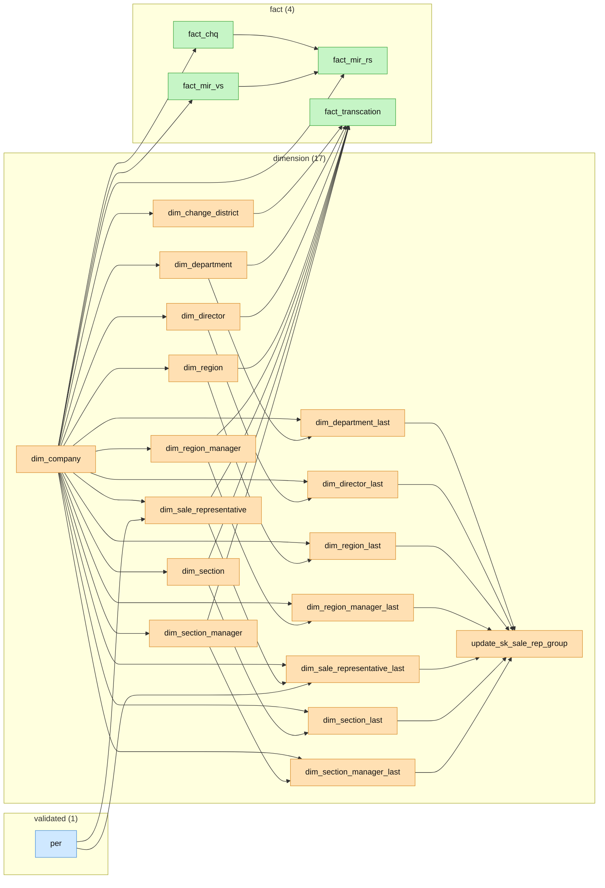

---

## Sales target / quota — เป้าการขาย

**Objects in this topic (5):** `dim_rate_target`, `dim_report`, `dim_target_product_group`, `dim_target_product_group_by_sale`, `dim_target_product_group_by_sale_dayofwork`

**Fed by (6):** `dim_calendar`, `dim_company`, `dim_department_last`, `dim_director_last`, `dim_product_mkt`, `update_sk_sale_rep_group`

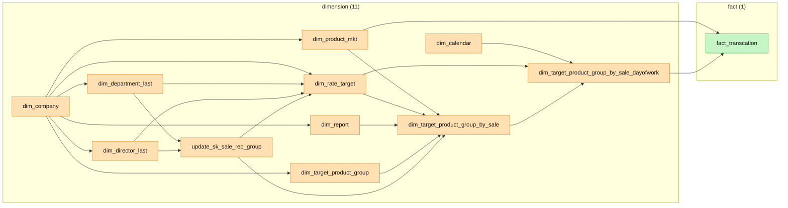

---

## Customer & scoring — ลูกค้า/เกรด/สกอร์

**Objects in this topic (10):** `dim_avg_collection_score`, `dim_bounce_cheque_score`, `dim_contact_score`, `dim_customer`, `dim_customer_grade`, `dim_grade`, `dim_group_customer`, `dim_group_customer_grade`, `dim_payment_receive_score`, `dim_weight_score`

**Fed by (16):** `chq`, `cql`, `curated_mih`, `customer_profile`, `customer_profile_nature_business`, `customer_status`, `customer_type`, `deb`, `dim_aging`, `dim_company`, `dim_status_not_receive`, `match_customer`, `mie`, `mih`, `mir`, `nature_business`

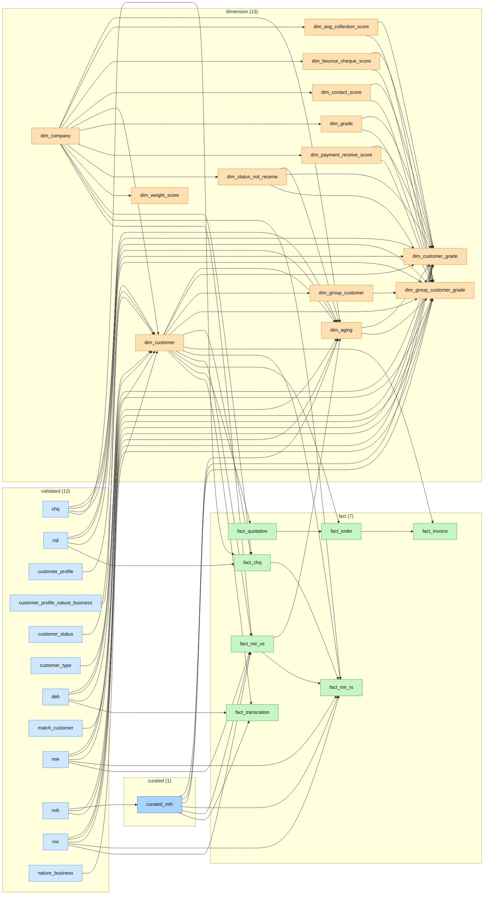

---

## Accounts receivable / aging — ลูกหนี้/อายุหนี้

**Objects in this topic (8):** `dim_aging`, `dim_aging_rang`, `dim_collection_status`, `dim_guarantee`, `dim_status_not_receive`, `fact_chq`, `fact_mir_rs`, `fact_mir_vs`

**Fed by (11):** `ar_s`, `cfs`, `chq`, `cql`, `curated_mih`, `curated_mil`, `dim_company`, `dim_customer`, `dim_invoice`, `mie`, `mir`

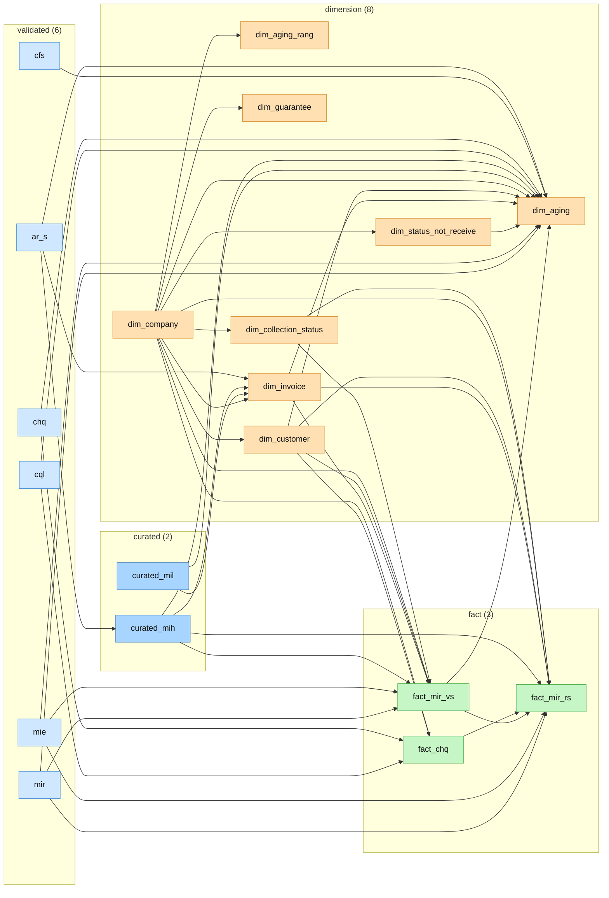

---

## Product master & marketing — สินค้า

**Objects in this topic (8):** `curated_product`, `dim_product_master`, `dim_product_master_fc`, `dim_product_mkt`, `dim_product_mkt_director`, `dim_rebate`, `dim_stk_mkt`, `product_for_aisearch`

**Fed by (9):** `brand`, `category`, `dim_company`, `product`, `product_detail`, `stg`, `stk`, `unit`, `vendor`

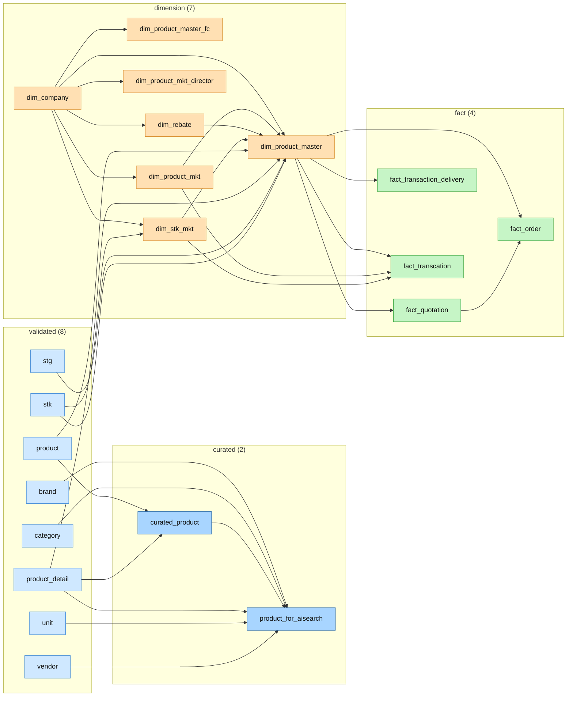

---

## Sales transactions — ยอดขาย/ออเดอร์/อินวอยซ์ (fact หลัก)

**Objects in this topic (8):** `curated_mih`, `curated_mil`, `dim_invoice`, `dim_order`, `dim_payment`, `fact_invoice`, `fact_order`, `fact_transcation`

**Fed by (25):** `ap_s`, `ar_s`, `deb`, `dim_change_district`, `dim_channel`, `dim_channel_cost`, `dim_company`, `dim_cost_group`, `dim_cost_stk`, `dim_customer`, `dim_department`, `dim_director`, `dim_product_master`, `dim_product_mkt`, `dim_region`, `dim_region_manager`, `dim_sale_representative`, `dim_section`, `dim_section_manager`, `dim_stk_mkt`, `dim_target_product_group_by_sale_dayofwork`, `fact_quotation`, `mih`, `mih2`, `mil`

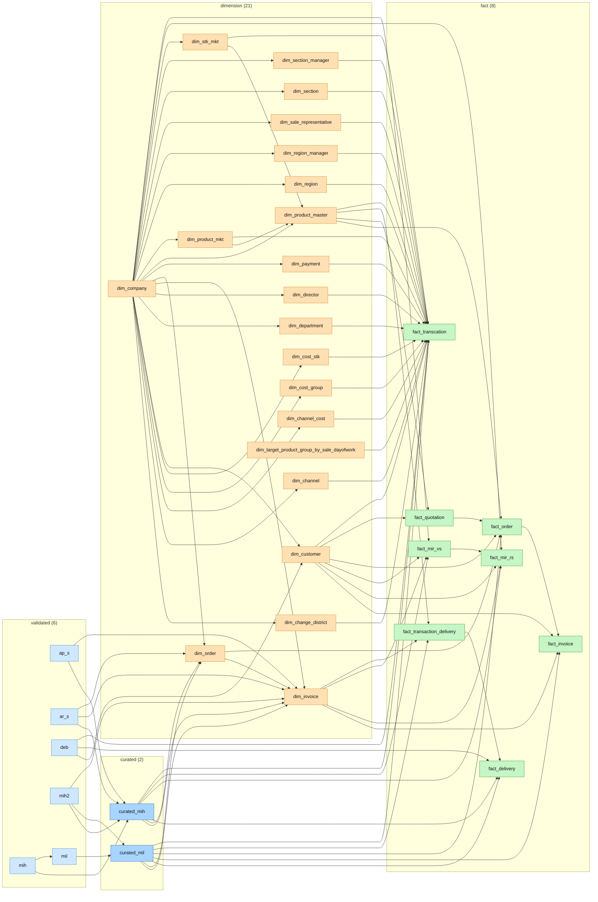

---

## Delivery / logistics — การจัดส่ง

**Objects in this topic (3):** `dim_delivery`, `fact_delivery`, `fact_transaction_delivery`

**Fed by (9):** `curated_mih`, `curated_mil`, `deb`, `dim_company`, `dim_invoice`, `dim_product_master`, `tdelivery`, `ttrip`, `ttrip_document`

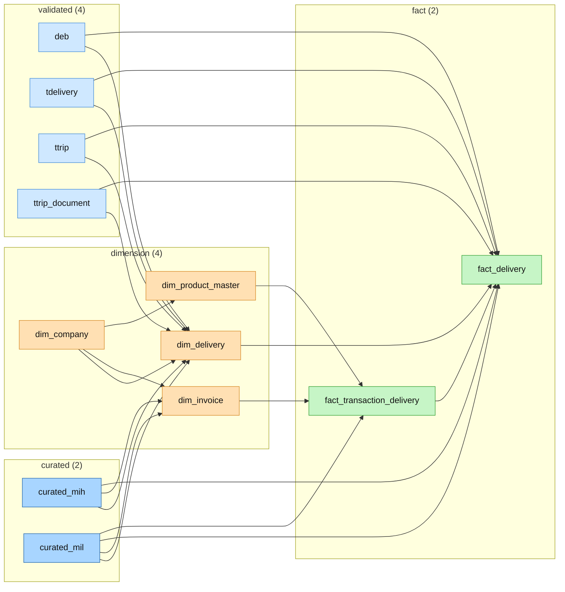

---

## Quotation / project — ใบเสนอราคา/โปรเจกต์

**Objects in this topic (4):** `curated_tbook_quotation`, `dim_project`, `dim_quotation`, `fact_quotation`

**Fed by (8):** `curated_mih`, `curated_mil`, `dim_company`, `dim_customer`, `dim_product_master`, `tbook_profilecomp`, `tbook_quodetail`, `tbook_quotation`

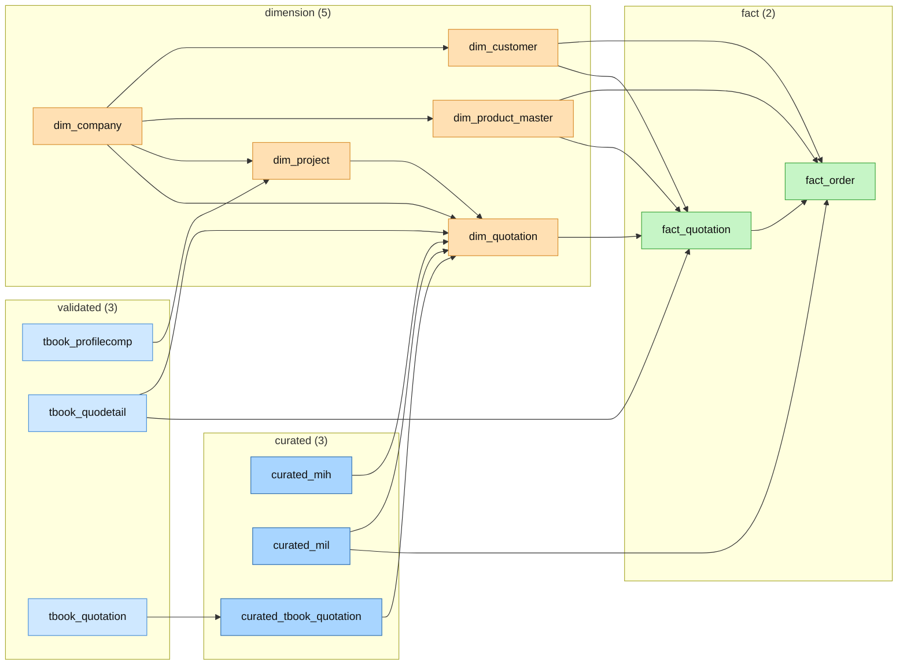

---

## Sales channel — ช่องทางขาย

**Objects in this topic (4):** `dim_channel`, `dim_channel_cost`, `dim_channel_finance`, `dim_channel_sales`

**Fed by (1):** `dim_company`

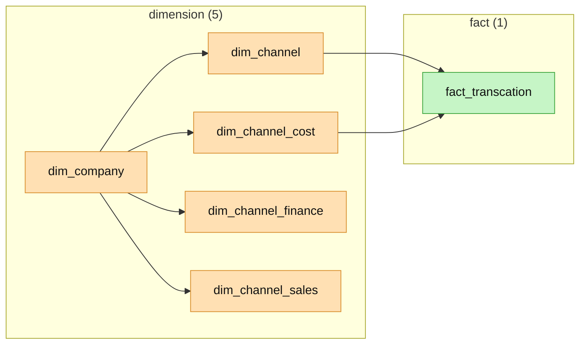

---

## Cost — ต้นทุน

**Objects in this topic (2):** `dim_cost_group`, `dim_cost_stk`

**Fed by (1):** `dim_company`

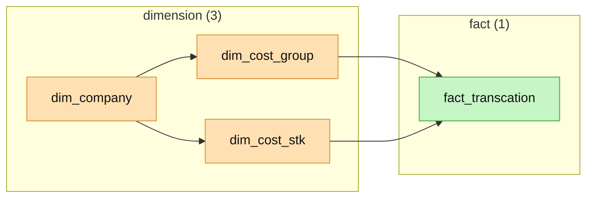

---

## Calendar / date spine — ปฏิทิน/วันหยุด

**Objects in this topic (2):** `dim_calendar`, `dim_holiday`

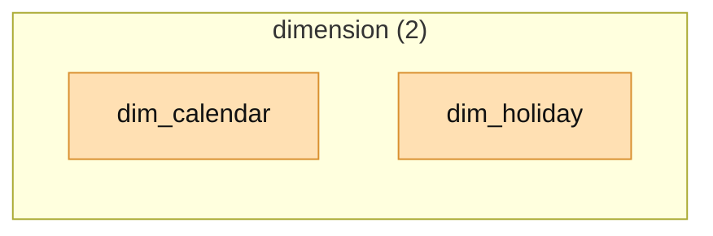

---

## Reference / misc — ตารางอ้างอิงอื่นๆ

**Objects in this topic (2):** `dim_doctype`, `dim_waterpac`

**Fed by (1):** `dim_company`

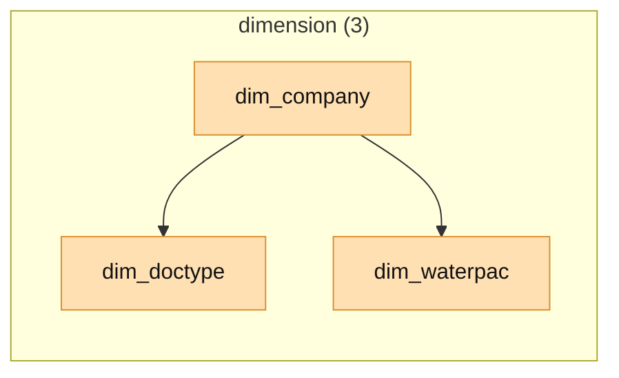
